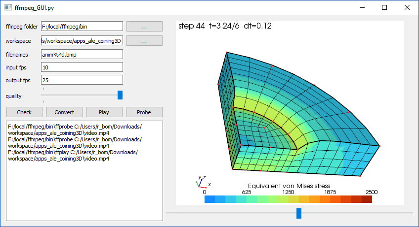

# Minimal GUI for ffmpeg

A basic multi-platform GUI written with PyQt for creating movies from a series of still pictures.
This program uses `ffmpeg`.

## Dependencies
  * [Python 3](https://www.python.org/)
  * [PyQt](https://www.riverbankcomputing.com/software/pyqt/intro), [Qt](https://www.qt.io/)
  * [ffmpeg](https://www.ffmpeg.org/)

## Usage

  * Run `ffmpeg_GUI.py`
  * Update the parameters. 
  * Click on [Check] and read the output. A preview should be displayed.
  * Click on [Convert]. The output is named `video.mp4` in the workspace folder.
  * Click on [Play] to see the results (runs `ffplay`)
  * Click on [Probe] to display statistics about `video.mp4` (runs `ffprobe`).

## Notes/TODO
  * check compatibility with PySide
  * make a smarter preview without loading all the images into memory
  * resize preview window
  * download ffmpeg if not found
  * clear settings
