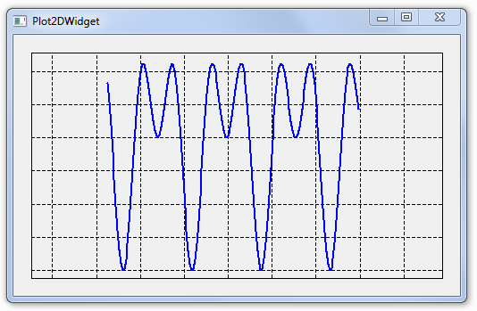

# Plotter

Widget Qt écrit en PyQt pour afficher des tracés 2D de fonctions.



## Structure du Projet

* **`core.py`** : Logique de domaine (structures `Point` et `Curve`).
* **`plot2dwidget.py`** : Widget Qt interactif (`Plot2DWidget`) gérant le tracé, la grille, le zoom à la souris et l'ajustement automatique (`autofit`).
* **`main.py`** : Point d'entrée principal définissant les fonctions mathématiques et affichant le graphique.

---

## Utilisation de l'Environnement Virtuel

Un environnement virtuel Python (`.venv`) a été configuré dans ce dossier afin d'isoler les dépendances nécessaires (notamment `PyQt5`).

### 1. Activer l'environnement virtuel

Selon votre système d'exploitation, exécutez la commande appropriée depuis votre terminal dans ce dossier :

* **Sur Linux / macOS :**
  ```bash
  source .venv/bin/activate
  ```

* **Sur Windows (Invite de commandes CMD) :**
  ```cmd
  .venv\Scripts\activate.bat
  ```

* **Sur Windows (PowerShell) :**
  ```powershell
  .venv\Scripts\Activate.ps1
  ```

Une fois activé, le nom `(.venv)` apparaîtra au début de l'invite de votre terminal.

---

### 2. Installer les dépendances (si nécessaire)

Les dépendances sont listées dans le fichier `requirements.txt`. Pour les installer ou les mettre à jour dans l'environnement virtuel activé :
```bash
pip install -r requirements.txt
```

---

### 3. Exécuter l'application

Une fois l'environnement virtuel activé, lancez le script de tracé principal :
```bash
python main.py
# ou directement (sur Linux/macOS) :
./main.py
```

---

### 4. Désactiver l'environnement virtuel

Lorsque vous avez terminé, vous pouvez quitter l'environnement virtuel en saisissant simplement :
```bash
deactivate
```
