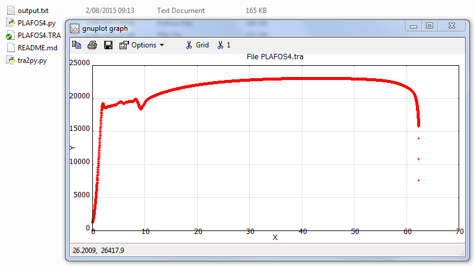

# tra2py

  - extract 2 columns from semicolon-separated values
  - write the 2 columns in a file
  - display the resulting curve with Gnuplot (if available)

## install
install gnuplot for python
 - [gnuplot](http://www.gnuplot.info/)
 - [gnuplot-py](https://pypi.python.org/pypi/gnuplot-py)

## run
```
./tra2py.py
```


