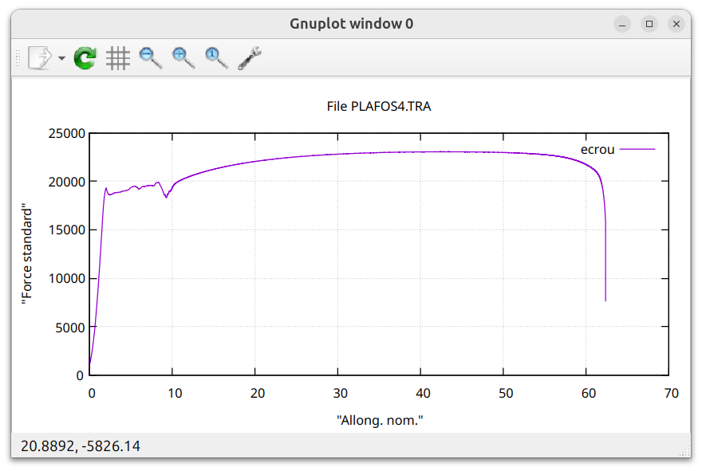

# tra2py

  - extract 2 columns from semicolon-separated values
  - write the 2 columns in a file
  - display the resulting curve with Gnuplot (if available)

## install
install gnuplot executable (no python gnuplot binding required)
 - [gnuplot](http://www.gnuplot.info/)

on Debian/Ubuntu:
```
sudo apt install gnuplot
```

## run
```
python3 tra2py.py
```

with explicit options:
```
python3 tra2py.py PLAFOS4 --name ecrou --x 1 --y 2 -o output.txt
```

headless mode (no plot window):
```
python3 tra2py.py PLAFOS4 --x 1 --y 2 --no-plot
```

help:
```
python3 tra2py.py --help
```


