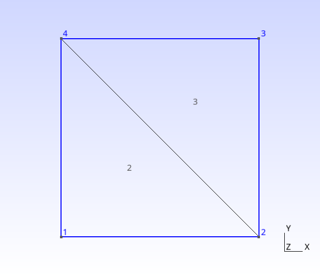
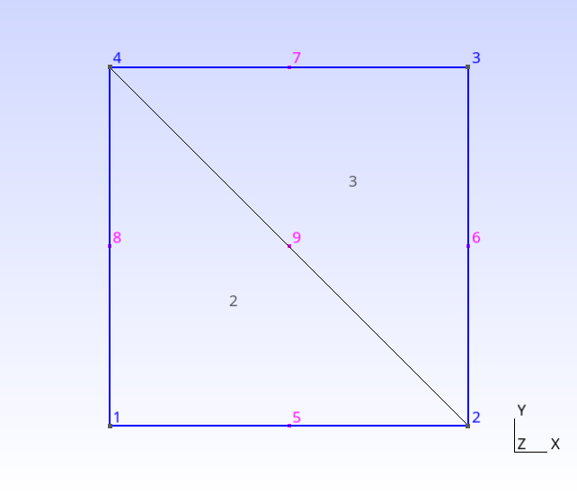
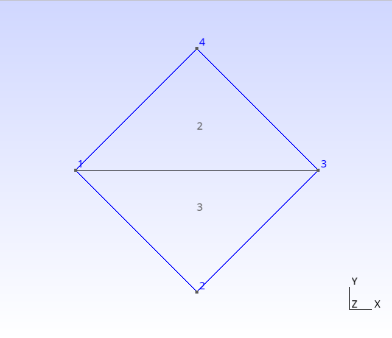

# Verification tests

This page gives the results (elemental matrices: $[M]$, $[S_x]$, $[S_y]$, fluxes: $\boldsymbol{f}^{\star}$, $\boldsymbol{\phi}$) for several basic tests, so that you can verify that everything is correctly implemented in your code.

### 2 triangles - linear basis functions

Test on a 1x1 square meshed with 2 triangles. The first one is exactly the same as the reference one in the $(\xi,\eta)$ plane.

Fluxes are calculated for the time increment with a (too large) time step $\Delta t = 1$ 

- input file: [square_2tri_lin.geo](square_2tri_lin.geo) 
- output file:  [square_2tri_lin.txt](square_2tri_lin.txt) 

### 2 triangles - quad basis functions

same test as the previous one with quadratic basis functions.

- input file: [square_2tri_quad.geo](square_2tri_quad.geo) 
- output file:  [square_2tri_quad.txt](square_2tri_quad.txt) 

### 2 triangles - linear basis functions - larger - rotated

Same test as the first one, on a larger (2x2) square, the square is split using the other diagonal and it is rotated by $\pi/4$.

* input file: [square_2tri_lin_larger_rotated.geo](square_2tri_lin_larger_rotated.geo) 

- output file:  [square_2tri_lin_larger_rotated.txt](square_2tri_lin_larger_rotated.txt) 

