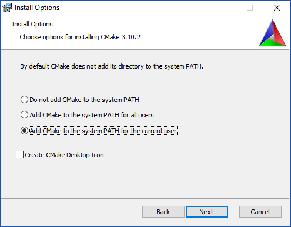

## what is it?

CMake is a portable way to write a "build system" for your source code, so that you can compile it easily with `make` or with an IDE. It will help you find libraries, headers, compiler flags for your PC and for CECI clusters. 

From a file named `CMakeLists.txt` describing the rules for building your source code, CMake is able to produce:
  * a set of Makefiles for gcc on Linux,
  * a set of Makefiles for MinGW on Windows,
  * Visual Studio projects for the Microsoft compiler on Windows,
  * Xcode projects for clang on macOS,
  * etc. 

## Installation

* Website: https://cmake.org/
* Choose the latest installer (e.g. `cmake-3.10.2-win64-x64.msi`).
* Run the installer (double-click on the `.msi` file)
* Add `cmake.exe` to your `PATH` so that is will be available in a command line window.


## Basic example:

* Open a command-line window.
* Create a folder (here below: `project`)
```
mkdir project
```
* Create a file named `main.cpp` in the `project` folder containing:
```
#include <iostream>
int main()
{
    std::cout << "CMake test\n";
    return 0;
}
```
* Create a folder named `build` in the `project` folder. This folder will contain all the things that will be created by CMake as well as the result of the compilation process; so that your source code will remain in a clean state.  
```
mkdir build
```
* Go to the `build` directory
```
cd build
```
* Run `cmake.exe`