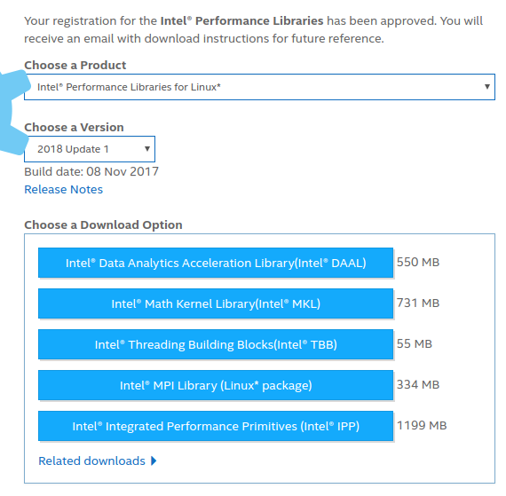

MKL (Math Kernel Library) is an optimised implementation of BLAS.
It is available on the CECI clusters and can be freely downloaded for your own machine.


## Your machine (Windows/Linux)

  * go to [Intel Performance Libraries](https://software.intel.com/en-us/performance-libraries)
  * register for free and download "Intel Math Kernel Libraries" (you don't need the other sets of libraries)



  * install (e.g. Linux)
```
tar xvzf l_mkl_2017.3.196.tgz
cd l_mkl_2017.3.196
./install_GUI.sh
```
  * once installed, the libraries can "added" to the environment (see `PATH`, `LIB`, `INCLUDE`, `MKLROOT`, etc.) with this line (Linux):
```
. /opt/intel/mkl/bin/mklvars.sh intel64
```
or (Windows):
```
call "C:\Program Files (x86)\IntelSWTools\compilers_and_libraries\windows\mkl\bin\mklvars.bat" intel64 vs2015
```

## CECI clusters

In the CECI clusters, use the following module:
```
module load intel/mkl/64/11.1/2013_sp1.3.174
```
