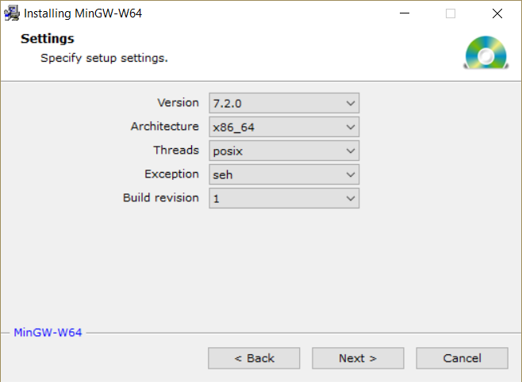
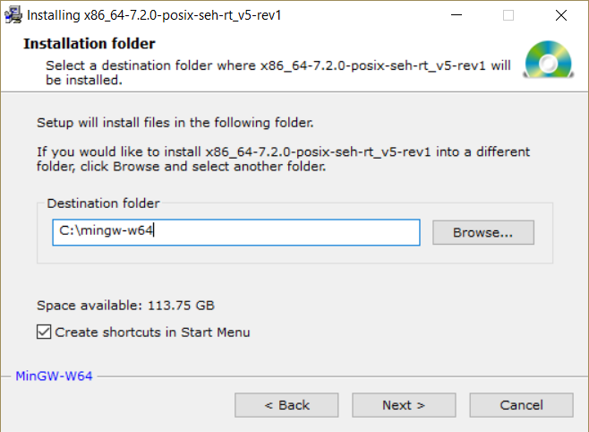

MinGW is a (free) set of compilers (C, C++, fortran) for Windows. They are based on gcc, the compiler that is used on the CECI clusters.

## Installation

Two versions are available on the web: 
  * MinGW : http://www.mingw.org/   (32 bits only!)
  * MinGW-w64 : http://mingw-w64.org/  (32 and 64 bits) <= choose this one.

Install the [MinGW-builds version](http://sourceforge.net/projects/mingw-w64/files/Toolchains%20targetting%20Win32/Personal%20Builds/mingw-builds/installer/mingw-w64-install.exe/download)

Choose the "x86_64" (64bits) instead of "i686" (32bits):


Then, shorten the installation path:


## Additionnal configuration

You can add the path to MinGW executable to your PATH, so that `g++` is available from any command-line window or terminal:
```
PATH = ... ; ...  ;C:\mingw-w64\mingw64\bin
```
You can also define a default value for the number of OpenMP threads
```
OMP_NUM_THREADS=1
```
If you have additionnal libraries somewhere on your PC (for example `C:\mingw-w64\libraries`), it is very usefull to add the path to the related folders to the `INCLUDE`, `LIB` and `PATH` environment variables, so that the files will be easily found by CMake:
```
INCLUDE= ... ; ... ;C:\mingw-w64\libraries\include
LIB= ... ; ... ;C:\mingw-w64\libraries\lib
PATH= ... ; ... ;C:\mingw-w64\libraries\bin
```


