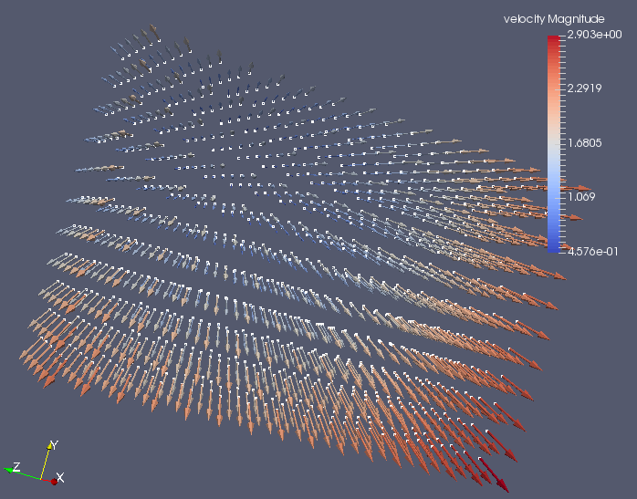

## What is it?

This small library can be used to export VTK files without linking to the huge VTK libraries.

For now, the following datasets are implemented:
  * set of points with scalar and vector data (exported as a [PolyData](https://www.vtk.org/doc/nightly/html/classvtkPolyData.html)) - useful for [SPH](https://en.wikipedia.org/wiki/Smoothed-particle_hydrodynamics) simulations.
  * structured grid aligned with X, Y, Z with constant spacing dx, dy, dz (exported as [ImageData](https://www.vtk.org/doc/nightly/html/classvtkImageData.html)) - useful for [FDTD](https://en.wikipedia.org/wiki/Finite-difference_time-domain_method) simulations.

The following [output formats](https://www.vtk.org/wp-content/uploads/2015/04/file-formats.pdf) are supported:
  * Legacy VTK, ASCII  (huge file - `.vtk` extension)
  * Legacy VTK, Binary (small file - `.vtk` extension)
  * XML VTK, Appended-Raw Binary (similar size to "Legacy VTK, Binary" - `.vtp`/`.vti` extension)
  * XML VTK, Compressed Appended-Raw Binary (smallest size - `.vtp`/`.vti` extension - requires [zlib](https://www.zlib.net/))

The `vtl` folder contains the library.

The `exe` folder contains 2 dummy solvers (sph/fdtd) which
  * create a mesh
  * simulate a time-integration loop:
     * generate some scalar/vector results for each point
     * save them to disk in the 4 available VTK formats

## build and run
```bash
mkdir build
cd build
cmake ..
make
./bin/sph
./bin/fdtd
mpirun -n 6 ./bin/fdtd_mpi
```
see also [CMake](https://cmake.org/)

## results
The programs generate several [VTK](http://www.vtk.org/) files which can be loaded into [Paraview](http://www.paraview.org/)

