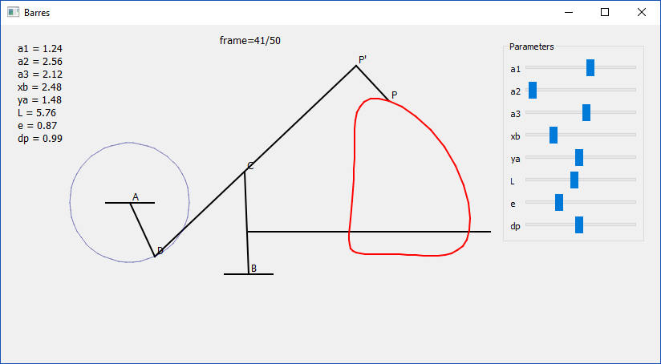

# Four-Bar Mechanism Simulator (DCM1)

Simple simulator of a 4-truss mechanism written during my studies at the University of Liege in 1994.

The code has been rewritten with Qt 5 instead of Borland Graphics Interface.




Desktop Qt application that simulates a planar four-bar linkage and visualizes
the mechanism motion and trajectories in real time.

## 1. Project Purpose

This project reproduces a historical student mechanism simulation in modern C++
with Qt Widgets.

Main goals:
- animate a four-bar mechanism over a full cycle,
- display key points and trajectories,
- allow interactive parameter tuning through sliders,
- keep the mathematical behavior consistent with the original model.

## 2. Main Architecture Overview

The application is intentionally small and organized around a Qt widget entry
point plus solver and renderer helpers.

High-level flow:
1. main creates QApplication and the main window.
2. Window builds UI controls (sliders) and hosts the mechanism widget.
3. Barres handles widget events, animation timing, and parameter updates.
4. MechanismKinematicsSolver computes linkage geometry for all sampled frames.
5. MechanismRenderer draws the current mechanism state and overlays.

Key files:
- main.cpp: application bootstrap.
- Window.h / Window.cpp: top-level UI layout and slider wiring.
- Barres.h / Barres.cpp: central QWidget, animation loop, geometry cache,
	slots, and paint delegation.
- MechanismKinematicsSolver.h / MechanismKinematicsSolver.cpp: pure kinematics
	computation.
- MechanismRenderer.h / MechanismRenderer.cpp: drawing logic with QPainter.
- tests/MechanismKinematicsSolver.test.cpp: deterministic solver-only tests.

## 3. Build Instructions

Requirements:
- CMake 3.16+
- C++11 compiler
- Qt5 Widgets development package

### Windows (Visual Studio generator)

```powershell
cmake -S . -B build
cmake --build build --config Release
```

Run:

```powershell
.\build\Release\barres.exe
```

### Linux or macOS (single-config generators)

```bash
cmake -S . -B build -DCMAKE_BUILD_TYPE=Release
cmake --build build
./build/barres
```

Notes:
- CMake uses AUTOMOC for Qt meta-object code generation.
- The main executable target is named barres.

## 4. Runtime Behavior

At startup:
- the main window opens with a viewer and a parameter panel,
- sliders are initialized to midpoint values,
- the animation timer starts when the viewer is shown.

During execution:
- Barres advances frame index periodically (25 ms timer).
- Geometry is recomputed only when parameters change.
- On each paint event, the cached geometry is rendered for the current frame.

UI controls:
- Sliders map integer range [0, 100] to physical parameter ranges for a1, a2,
	a3, xb, ya, L, e, and dp.
- Any slider change marks geometry cache dirty and triggers fresh solver output
	on the next paint.

## 5. Refactored Components

The codebase now separates computation and drawing while keeping Barres as the
central widget:

- MechanismParameters
	- plain struct containing mechanism parameters.

- TrajectoryGeometry
	- plain struct containing sampled coordinates for all frames.

- MechanismKinematicsSolver
	- pure computation API:
		TrajectoryGeometry compute(const MechanismParameters&, int nframes)
	- no Qt dependency.

- Barres geometry cache
	- stores last TrajectoryGeometry result,
	- recomputes only when parameters are modified.

- MechanismRenderer
	- consumes cached geometry and current parameters,
	- applies world-to-screen transform,
	- performs all QPainter drawing operations in fixed order.

This keeps behavior stable while improving testability and localizing
responsibilities.

## 6. Test Instructions

Current automated tests focus on solver correctness and do not depend on UI.

Build test target:

```powershell
cmake -S . -B build
cmake --build build --config Release --target mechanism_kinematics_solver_test
```

Run via CTest:

```powershell
ctest --test-dir build -C Release -R mechanism_kinematics_solver_test --output-on-failure
```

What is validated:
- deterministic coordinate checks at selected frames for fixed parameter sets,
- geometric link-length constraints (AD, DC, BC) with double-precision
	tolerances.

This gives fast, deterministic regression coverage for core mechanism
computation independent of rendering and event timing.

